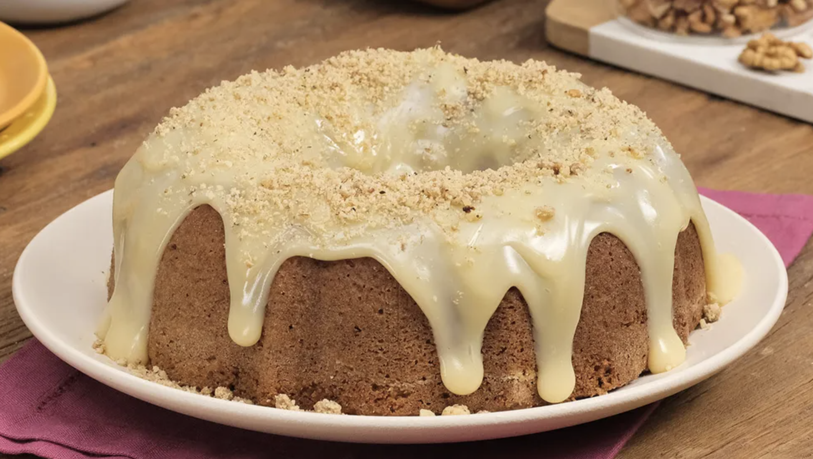

# Receita de Bolo de Nozes

## Projeto 
Meu primeiro projeto no SENAI, na disciplina Linguagens de marcação, com o professor Fernando Leonid

## Tecnologias
* HTML
* CSS
* GIT

##[Laura Bandeira]((https://www.linkedin.com/in/laura-bandeira-806981353?utm_source=share&utm_campaign=share_via&utm_content=profile&utm_medium=ios_app))

